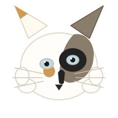

<h1 align="center">
  
  Olá, eu sou a Flávia 👋
</h1>

  Desenvolvedora em transição de carreira, com foco em Front-end e caminho para Full Stack.

  
  

---

### 🖋 Sobre mim

- 🌱 Iniciei minha transição de carreira em janeiro de 2022
- 💻 Foco atual em Front-end, com objetivo de me tornar desenvolvedora Full Stack
- 📚 Sempre aprendendo e evoluindo minhas habilidades técnicas

### 🛠 Tecnologias

  
  
  

### 📊 Estatísticas

  

  

